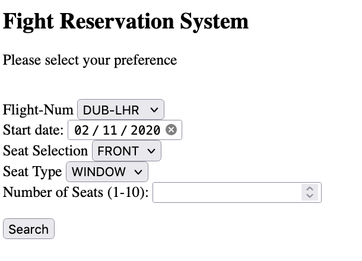
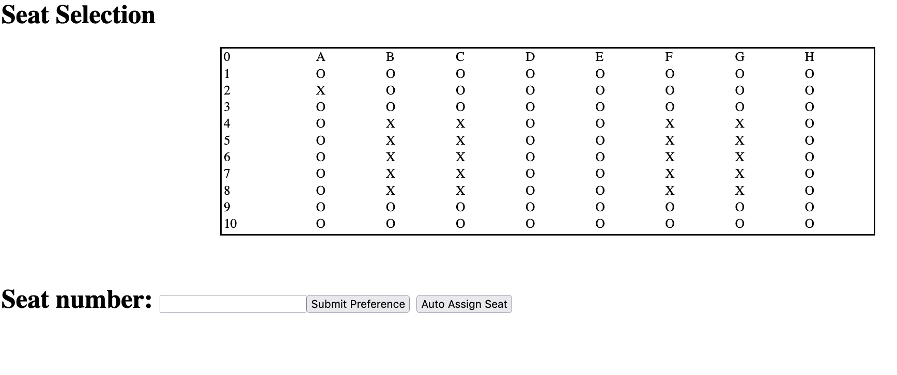

# Airplane Seat reservation System 


----


## Steps to run the project : 

This project is a build using SpringBoot and compiles with mvn

Either you can build project using maven package or 

``` java -jar flight-0.0.1-SNAPSHOT.jar ```


once the Jar is created , this project uses mysql database on local to manage flight info , I have attached a .sql file in the project with the name : 
flight_db.sql   that needs to be run on the database to generate dummy flight data which contains info on flight number and number of seats in the flight etc 


This would start a Webserver at port localhost:9090/index.html . Below is what it will look like 


----

This is the Selection page where User can select  Seat preference , Flight Name , Seat type and Number of Seats required . On clicking Submit the User would be showed  



--

On selecting the preferences the below Seat arrangement would be shown 



---

## user would have two option : 

>  Select the seats manually by typing in  :  A4,B5  or A2,C6 etc 
>  Other option is to click Auto Select which will select and allocate the seats based on user preference 

---


